# About 📄

## Table of Contents
- [Key Features ](#keyfeatures)
- [Tools](#tools)
- [Diagrams](#Diagrams)
- [Implementations](#implementations)
- [Meetings](#meetings)
- [Reports](#reports)

## Key Features 
- **Bike, Scooter, and Skateboard Rentals**: Rental service for bikes, scooters, and
skateboards to enhance campus mobility
- **Transportation Schedules**: Display a weekly schedule of the bus leaving and coming to campus.
- **Interactive Maps**: Navigate the Map
- **Real-Time GPS Tracking**: : Track real-time location of campus shuttles, buses, and
other transportation services
- **Accessibility Routes**:  Provide routes that accommodate individuals with disabilities.
- **Rental Stations**: Locate and check availability of rental stations across campus.

## Feature list
A feature list in app documentation is a detailed outline of the key functionalities or capabilities of an application. It provides a clear, structured summary of what the app can do, serving as a quick reference for developers, users, or stakeholders to understand the main offerings of the app. Each feature may include a brief description of its purpose and how it benefits the user.
###  User Login and Password Management
Users can log in by entering their credentials, including email and password. The password must meet certain requirements, such as a minimum length and the inclusion of special characters. If a user forgets their password, they can use the "Forgot Password" feature to reset it, and a confirmation email will be sent to them for verification.

- **User benefit** : Provides secure access to accounts with password validation for enhanced security. The "Forgot Password" feature ensures users can regain access to their accounts if needed.

- **Dependecies** : Requires a valid email address for account creation and password reset functionality. Email service must be configured to send confirmation emails.

- **Status** : Available and fully functional.

### Singup Page
New users can create an account by providing the following information:Username,Email address, and a password.
- **User benefit** : Email verification ensures that only valid accounts are created,Strong password requirements help enhance account security..
- **Dependecies** : A valid email address is required for signup and email verification.
- **Status** : Available and fully functional.

### Sidemenu
The side menu provides easy navigation to the following sections of the app:
- **Home Page**
- **Profile Page**
- **Bus Schedule Page**
- **Rentals Page**
- **Logout Page**

- **User benefit** : Convenient navigation to essential app features,Simplifies returning to the homepage or securely logging out from the app.
- **Dependecies** : The profile, bus schedule, and rentals pages require users to be logged in.
- **Status** : Available and fully functional.

### Search Bar
Allows users to look up for locations around campus.
#### Filtered search list
Users are able to search up locations around campus and get help from the filtered list they won't have to type up the whole name of the location.
#### Results 
The search result consist of the picture of the list and description.

- **User benefit** : it is faster for users to lookup places, users get to have a picture of what the place they're looking for looks like.
- **Dependecies** :  Requires internet access for search queries.
- **Status** : Available and fully functional.

### Map
The Maps feature integrates Google Maps into the app, allowing users to explore various locations and landmarks related to rentals.
#### Locations - Popup Information
When you interact with the landmarks or locations on the map, you get a mini-popup about the location
#### Rentals landmarks
We added bicycle,car,skateboard landmarks on the map to show available rentals. when you interact with the landmarks, you can see if you have to dropoff there or it's too far from your current location.
#### Dark/Light mode feature
you can change the map from light mode and back to dark mode.

- **User benefit** : Easy navigation and exploration of rental landmarks through an interactive map,Informative popups enhance the user experience by providing relevant details about each location.
- **Dependecies** : Requires an active internet connection for Google Maps to function properly,Google Maps API must be integrated and configured within the ap
- **Status** : The Maps feature is fully implemented and operational, providing users with a seamless experience in exploring rental landmarks.
### Profile page
The Profile Page provides users with a personalized overview of their account information, change password feature, including their username, email, kudubucks balance, and current rental details.

- **User benefit** : Provides a quick and easy way for users to view their account details and current rentals,Enhances user engagement by displaying kudubucks,
- **Dependecies** : Requires user authentication to access profile information,Rental data must be linked to the user’s account for accurate display.
- **Status** : The Profile Page is fully functional and provides a comprehensive overview of user information.

### Home Page
The Map Card feature enhances user interaction with the map by providing options to customize the map's theme and view directions based on their preferred mode of transportation.

- **User benefit** : Personalizes the map experience, catering to individual user preferences for theme and navigation style.
- **Dependecies** : Requires integration with mapping services (e.g., Google Maps API) to implement theme changes and generate accurate directions based on user selection,An active internet connection is necessary for real-time map updates and navigation features.
- **Status** : The Map Card feature is fully implemented and operational, offering users a versatile and customizable mapping experience.

### Transport Schedule page
The Transport Schedule Page provides users with comprehensive information about bus schedules, helping them plan their travel efficiently. Users get to see Types of Schedule,Bus Schedule Display and Interactive Features

- **User benefit** : Provides clear and organized access to bus schedule information, aiding in effective trip planning.
- **Dependecies** : We get the latest bus schedule from the wits website.
- **Status** : The Transport Schedule Page is fully operational and provides users with essential bus schedule information
### Rentals Page
The Rentals Page allows users to book a single vehicle from the available bus schedules, providing a convenient way to secure transportation for their travel needs.
- **User benefit** : Provides clarity on available options and limits bookings to one vehicle, reducing the chances of overbooking.
- **Dependecies** : An active internet connection is necessary for real-time updates and booking confirmations.
- **Status** : The Rentals Page is fully functional and allows users to easily book vehicles from the available bus schedules.

### Logout Page
The Logout Page provides users with a straightforward and secure way to end their session within the app.
When users navigate to the logout page, they are presented with a confirmation message that asks if they are sure they want to log out. This prevents accidental logouts.

- **User benefit** : Enhances security by providing a clear and deliberate logout process, minimizing the risk of unauthorized access,Gives users confidence that their session has been successfully terminated.
- **Dependecies** : Requires integration with the authentication system to securely log users out.
- **Status** : The Logout Page is fully implemented and operational, allowing users to log out of their accounts securely and efficiently.

## Tools
- **Jira**: For planning.
- **Frontend**: React js,CSS.
- **Backend**: Express Js,Node Js, Azure, Vercel.
- **Communication**: Discord,Whatsapp,Emails
- **Authentication**: Firebase
- **Database**: Firebase Firestore
- **Figma**: Designing the UI and Protoype

## Diagrams

### user story

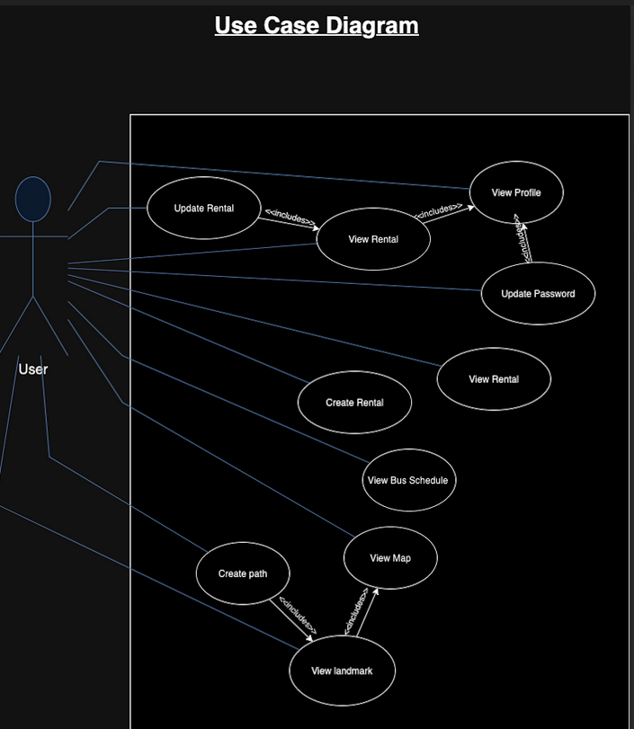

### Class diagram

see "link to data schema section"

### Deployment Diagram

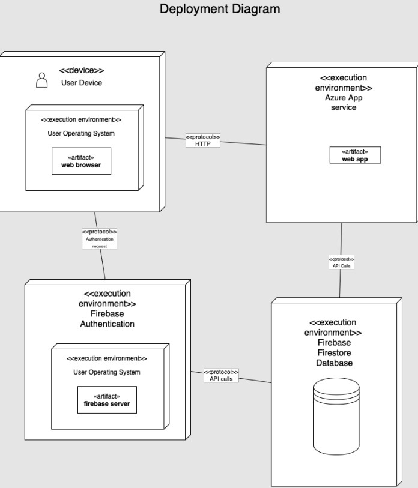

### Component Diagram

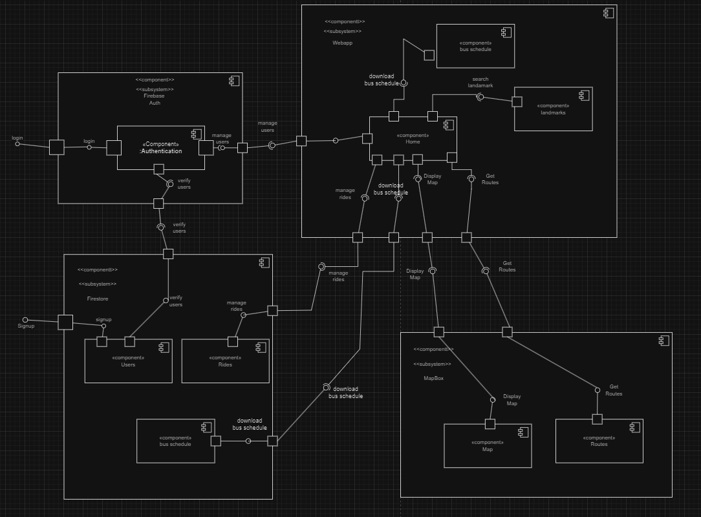

### Wireframe

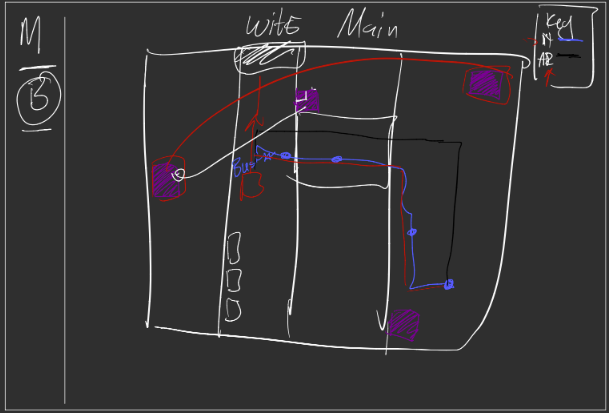
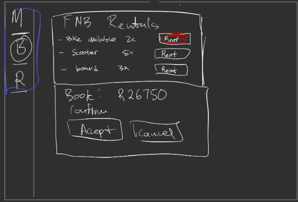
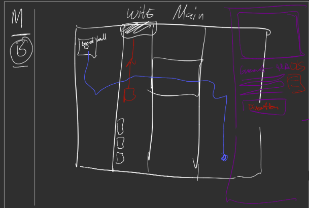
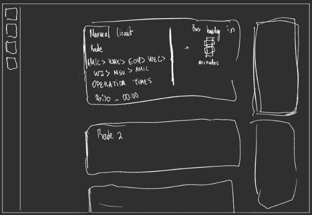

### Initial Mockups
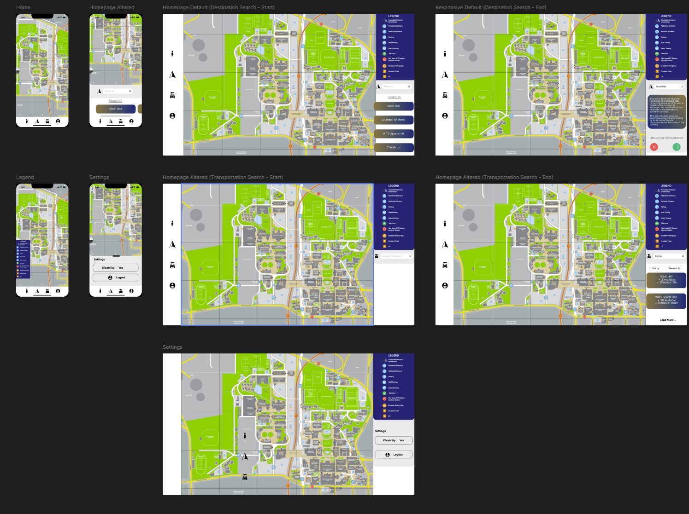

### Official Mockups & Mobile view

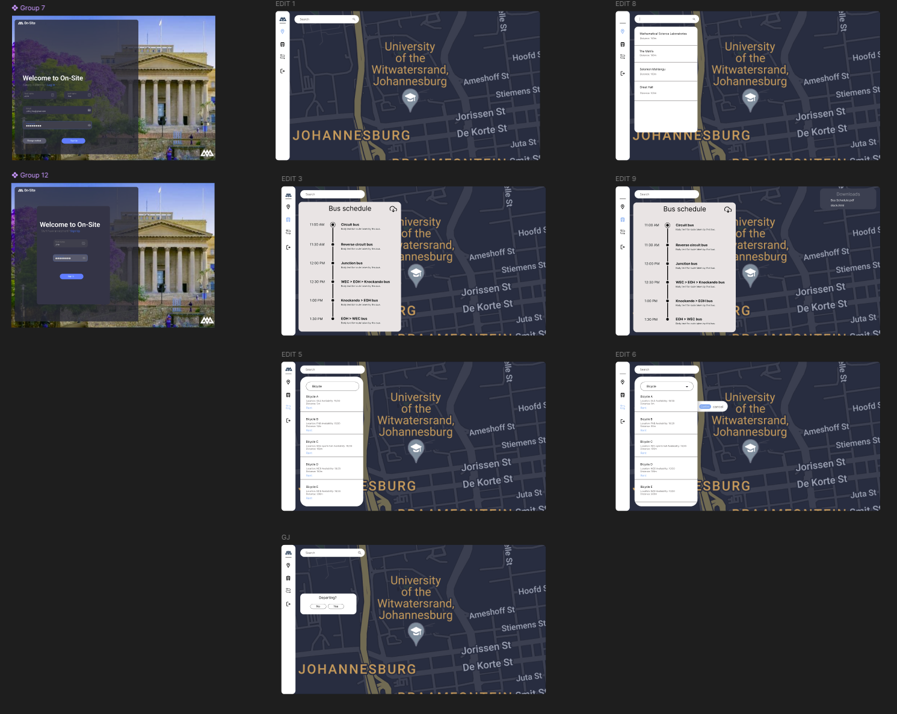
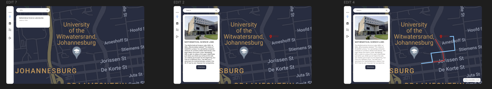

#### Mobile view

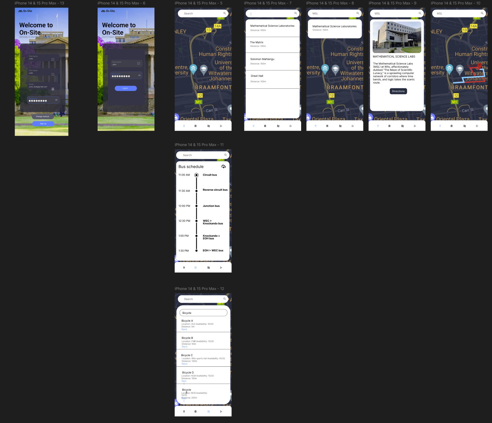

### Protoype

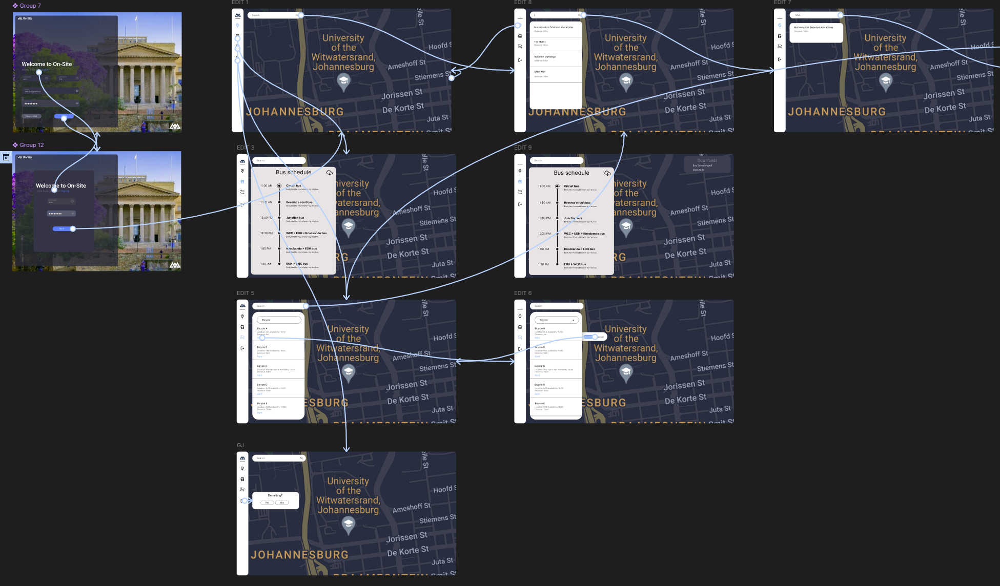
If you want to interact with the prototype
**Figma Link**: https://www.figma.com/proto/ZuXHB5KS0UVghmuc7LD21M/Campus-Transportation?node-id=65-193&node-type=canvas&t=xv0NqEbJMG7L7af0-0&scaling=contain&content-scaling=fixed&page-id=0%3A1&starting-point-node-id=65%3A193&show-proto-sidebar=1

## Implementations

### Changes requested by our supervisor
- **Add some validation on the login/signup**: At the beginning of our app the user just had to put in their detail in this an email and password but after our meeting with our supervisor on the 5th of september, He suggested thAvailable and fully functional.at we coudld have some validation for our password, like having special characters in our pasword also the having a specific length for the password. On top that we added a toast that pops everytime the user's password doesn't satisfy the requirements.
- **Add a hello {username} feature**: Every user has their name and email stored in the database such everytime when they log in to our system, on the profile page their usename printed out.Like the image below.

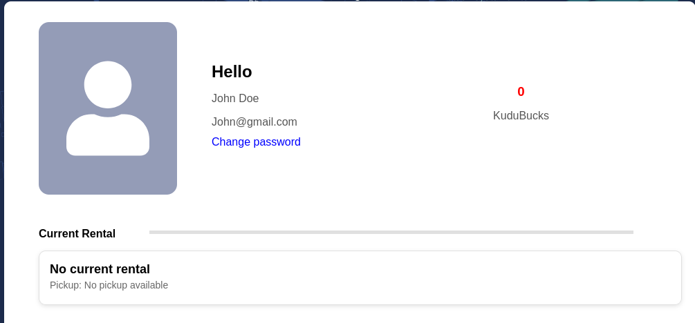

- **Add a profile page**: The image above is the implemented profile page on our system, shows you booked vehicles, it has it's own kudubucks system.
- **Add a change password feature on the Profile page**: Below is an image that kind of shows how a user can change their password on the profile page, they click the "change password link" and a pop up will show up, and they can either cancel or change their password.
- **Add Renting stations on the map**: We decided to add a bicycle landmark to every rental station on main campus.
- **Add pickup and dropoff stations**: Every user should be able to dropoff their vehicle to the nearest dropoff station

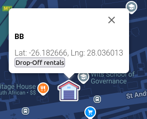

- **Add more fuctionality to the rentals page**: We decided that the user should be able to dropoff their vehicle to the nearest station and instead of canceling their ride they should either complete their request or drop off their vehicle but they will still be charged.
### Changes we discussed 
- **Change the theme of the app**: Now we added a feature for light/dark mode 
- **Add accessible routes on the map**:🐾
### Changes after integrating with other APIs
See "https://organisation-a.github.io/Campus-Transportation-Docs/#/api"

## Meetings

### Meetings Calendar

<iframe src="https://calendar.google.com/calendar/embed?src=91c70e37bf75f308d704076c16705683a16d3bfd0d0e8f4c76d1c2406452c19b%40group.calendar.google.com&ctz=Africa%2FJohannesburg" style="border: 0" width="800" height="600" frameborder="0" scrolling="no"></iframe>

### Future plans
As seen from the Calendar we have been tracking when to have out meetings and we do we need to plan our upcoming implementations for our app

### Timeline
For proof of meeting please checkout our drive "campus transportation>Meetings" :https://drive.google.com/drive/u/0/folders/1zxj784kdAtxYXiMoWFnsLQTfLaxCZ4dK
#### Scrum 1 🎯
#### 12 August 2024 
- objective: What tools we need to use
- Dicussion: Tools, setting up our environment and getting started
- Attendees: Uhone, Kgolagano, Lethabo, Obakeng, Gael, Wendy
- issues: Which tools would be easier to use.
- Goals: Be familiar with react, start up jira, create accounts and create a repo.
#### 14 August 2024
- objective: Completing the UI
- Dicussion: Designing Wireframe and assigning roles
- Attendees: Uhone, Kgolagano, Lethabo, Obakeng, Gael, Wendy
- issues: Picking a consistent theme
- Goals: Evaluate everyone's idea and pick the best choice and implement it
#### 17 August 2024
- objective: Implementing the Best UI and planning our database
- Dicussion: UI designs and database schema,API
- Attendees: Uhone, Kgolagano, Lethabo, Obakeng, Gael, Wendy
- issues: What happens when we run out of credits.
- Goals: Code the basic UI
#### 18 August 2024
- objective: Fix the prototype
- Dicussion: UI design and Prototype
- Attendees: Uhone, Lethabo, Gael, Wendy
- issues: None
- Goals: Code the basic UI
#### 20 August 2024 Milestone 1 🏆
#### Scrum 2 🎯
#### 24 August 2024
- objective: Discussing Milestone 1 results
- Dicussion: Milestone 1 Overview
- Attendees: Uhone, Kgolagano, Lethabo, Obakeng, Gael, Wendy
- issues: We need to communicate with other groups and send out our API specification
- Goals: Make an API soecification
#### 28 August 2024
- objective: Way forward implementing what we missed in milestone 1
- Dicussion: Milestone 1 Overview
- Attendees: Uhone, Kgolagano, Lethabo, Obakeng, Gael, Wendy
- issues: it was taking time to deploy the hello page, start working our APIs
- Goals: Work on Map Data API fix the deployment issue.
#### 29 August 2024
- objective: showing our progress to our client
- Dicussion: Client Meeting
- Attendees: Uhone, Kgolagano, Lethabo, Obakeng, Gael, Wendy, Luca
- issues: API development
- Goals: Implement the features our client requested
#### 04 September 2024
- objective: Progress on the features our client requested
- Dicussion: Client Meeting
- Attendees: Uhone, Kgolagano, Lethabo, Obakeng, Gael, Wendy
- issues: Fixing buggy pages
- Goals: Implement the features our client requested
#### 05 September 2024
- objective: Overview of the requested features
- Dicussion: Client Meeting
- Attendees: Uhone, Kgolagano, Lethabo, Obakeng, Gael, Wendy, Luca
- issues: Fixing buggy pages
- Goals: Implementations.
#### 11 September 2024
- objective: Progress on the features our client requested
- Dicussion: Client Meeting,
- Attendees: Uhone, Kgolagano, Lethabo, Obakeng, Gael, Wendy
- issues: Fixing buggy pages
- Goals: Implement the features our client requested
#### 12 September 2024
- objective: Overview of the requested features
- Dicussion: Client Meeting, adding more features like having a login,signup page
- Attendees: Uhone, Kgolagano, Lethabo, Obakeng, Gael, Wendy, Luca
- issues: Fixing buggy pages
- Goals: Implementations.
#### 14 September 2024
- objective: Progress on the features our client requested
- Dicussion: Client Meeting
- Attendees: Uhone, Kgolagano, Lethabo, Obakeng, Gael, Wendy
- issues: Fixing buggy pages
- Goals: Implement the features our client requested

#### 17 September 2024 Milestone 2 🏆
#### Scrum 3 🎯

#### 23 September 2024
- objective: Overview of milestone 2
- Dicussion: Client Meeting, adding more features like having a login,signup page
- Attendees: Uhone, Kgolagano, Lethabo, Obakeng, Gael, Wendy
- issues: Fixing buggy pages
- Goals: Implement the features our client requested

#### 24 September 2024
- objective: Way forward implementing what we missed in milestone 2
- Dicussion: Milestone 1 Overview
- Attendees: Uhone, Kgolagano, Lethabo, Obakeng, Gael, Wendy
- issues: it was taking time to deploy the hello page, start working our APIs
- Goals: Transitioning from azure to vercel and improving our work.
#### 26 September 2024
- objective: Overview of the requested features
- Dicussion: Client Meeting, adding more features like having a login,signup page
- Attendees: Uhone, Kgolagano, Lethabo, Obakeng, Gael, Wendy, Luca
- issues: Fixing buggy pages and communicating with other groups
- Goals: Implementations.
#### 27 September 2024
- objective: Progress on the features our client requested
- Dicussion: Client Meeting
- Attendees: Uhone, Kgolagano, Lethabo, Obakeng, Gael, Wendy
- issues: Fixing buggy pages
- Goals: Implement the features our client requested
#### 28 September 2024
- objective: Progress on the features our client requested(Daily scrum)
- Dicussion: Client Meeting
- Attendees: Uhone, Kgolagano, Lethabo, Obakeng, Gael, Wendy
- issues: Fixing buggy pages
- Goals: Implement the features our client requested
#### 29 September 2024
- objective: Progress on the features our client requested(Daily scrum)
- Dicussion: Client Meeting
- Attendees: Uhone, Kgolagano, Lethabo, Obakeng, Gael, Wendy
- issues: Fixing buggy pages
- Goals: Implement the features our client requested
#### 30 September 2024
- objective: Progress on the features our client requested(Daily scrum)
- Dicussion: Client Meeting
- Attendees: Uhone, Kgolagano, Lethabo, Obakeng, Gael, Wendy
- issues: Fixing buggy pages
- Goals: Implement the features our client requested

### 03 October 2024
- objective: Overview of the requested features and preparation for milestone 3
- Dicussion: Client Meeting, adding more features like having a login,signup page
- Attendees: Uhone, Kgolagano, Lethabo, Obakeng, Gael, Wendy, Luca
- issues: Fixing buggy pages and documenation
- Goals: Implementations.
#### 05 October 2024 Milestone 3 🏆

## User Guide 
Welcome to the User Guide for our app! This guide will walk you through the key features and how to use them effectively.
### Getting Started

To begin using the app, make sure you've created an account or logged in with an existing one. Here's a quick overview of the key pages and functionalities available.

### Login and Signup

#### Login Page
- Enter your registered email and password to access the app.
- If you've forgotten your password, click on the **Forgot Password** link. You'll receive an email to reset your password.

#### Signup Page
- New users can create an account by prThe app looks amazing! I found it easy to use, and the interactive map is a standout feature for me. It's awesome to see all the rental stations and events in one place. Plus, the design looks modern and smooth!
- **Homepage**: Your main dashboard.
- **Bus Schedule**: View and download bus schedules.
- **Rental Service**: Browse and book available vehicles from rental stations.
- **Profile**: Manage your account details and view bookings.
- **Logout**: Sign out of the app.

### Search and Map Features

The app has a powerful search feature:

- At the top of each page, there's a search bar. You can type in places to search, and a filter is available to narrow down the results.
- Results include:
  - A picture of the place
  - A brief description
  - The location on the map
  
#### Map Interaction
- You can interact with the map to explore different places.
- It displays locations such as:
  - Rental stations
  - Events happening on campus
- Clicking on a location shows a pop-up with details about the place.

### Bus Schedule

#### Viewing Bus Schedules
- On the **Bus Schedule** page, you can view different bus schedules.
- There are multiple schedules for different routes and timings.

#### Downloading Schedules
- You have the option to download the schedule for offline use.

### Rental Service

#### Viewing Rental Stations
- On the **Rental Service** page, you can view all the available rental stations around campus.
  
#### Booking a Vehicle
- Each rental station displays the vehicles available for booking.
- You can choose and book an available vehicle directly from the app.

### Profile Management

#### Viewing Profile
- On the **Profile** page, you can view your:
  - Name
  - Email
  - Kudubucks balance (used for rentals)

#### Changing Password
- You can change your password in the profile section for security.

#### Viewing Bookings
- You can also view your booking history in this section.

### Logout

- To log out of the app, simply click on **Logout** from the side menu. This will safely end your session.

## User Feedback 

#### Client feedback
"Our app looks great so far there's Progress but requires more functionality and depth"

### External feedback 

1. User 1 : Classmate -
"The app's design is really intuitive! I love how easy it is to navigate between the different pages, and the map feature is super handy for finding locations on campus. Overall, it looks polished and professional!"

2. User 2: Classmate -
"I really like the clean layout of the app, especially the side menu – it makes everything feel so organized. The search bar with filters is a great touch, and the way results are displayed with pictures and descriptions is really user-friendly."

3. User 3: Roommate -
"The app looks amazing! I found it easy to use, and the interactive map is a standout feature for me. It's awesome to see all the rental stations and events in one place. Plus, the design looks modern and smooth!"

## Reports
- On the 12th of August we had issues with trying to deploy the "Hello-world" page
- We had problems with communicating with Campus safety group a their apis required ids which we didn't get
- Events group did not provide their APIs instead they gave us their API documentation
- We had problems trying to deploy using AZURE so we tried out vercel
- Our app takes an hour to deploy
- We ran out of credits on firestore so we had to upgrade.
- We could not implement the accessibility feature as we cannot edit the google map
- We were unable to implement the live tracking feature due to its complexity, which exceeds our current level of expertise.
### More technical reports

#### Technical Report on Deployment

I have attempted deploying a React application to Azure services as a Web App service. The deployment was initially done on the free tier, but after second consideration, I scaled up to the Basic B1 tier.

Issues Encountered

1. NPM installation warnings.
	-Deprecated packages such as w3c-hr-time, rimraf, rollup- plugin-terser, and others.
	-Recommendations to update or replace certain packages due to security concerns

2. Build and Test Errors.
	-Failed a test case where a logo was imported and not used.

3. Deployment Issues.
	-504 Gateway Timeout because the server took too long
	-Application Error : 3 minutes upon loading site
	-Application failing to start.

#### Technical Report on GitHub

We used GitHub for our version control, which requires that we do some setup. In order to allow collaborators to make changes to the GitHub settings, such as editing environment variables or publishing documentation, collaborators needed admin access. To achieve this, we decided to transfer ownership of the Group-A repository to Organisation-A. Several issues happened as a direct cause of this:

1. GitHub OIDC Authentication Error: The OIDC authentication failed because no matching federated identity was found for the presented assertion. This often happens when the Subject, Audience, or Issuer is not configured correctly in the Azure federated credential. After transferring ownership, the subject of our repository changed, leading to conflicts with what Azure was expecting.

2. App Registration and Identity Configuration: The app was not automatically registered, leading to confusion about whether it had a managed identity associated with it.

3. Deployment Failure (Not Found): 
Deployment failed with the error: ##[debug]Deployment status: 0 'Receiving changes.'. retry after 5 seconds.
This error occurred repeatedly until the workflow timed out or was cancelled.

4. Long Deployment Time: Deployment was taking approximately 45 minutes, which is far longer than expected for typical web apps.

#### Technical Report on MapBox

We’ve been working on integrating Mapbox into our project, adding various features such as custom markers, paths, directions, and interactive elements. During the process, several technical issues have arisen that have impacted the smooth implementation of these features.

1. Missing Key Footpaths in Default Map
Problem: The default Mapbox maps did not include certain key footpaths critical for accurate navigation and route planning.

2. Adding Custom GeoJSON Paths to Map
Problem: We needed to load a custom GeoJSON file into the Mapbox map to show specific paths.

3. Using Geolocation to Get Current Position
Problem: We needed to retrieve the user's current location to dynamically set it as the starting point for directions at a set refresh interval.

#### Technical Report on Data Collection

Data used for the Map Data API was manually collected and inserted into Firestore.

Resources used:
1. The Wits website: A map with all the buildings to record into the database, with their respective descriptions.
2. Google Earth: Coordinates of all the buildings.
3. Google Search: Images of all the buildings.