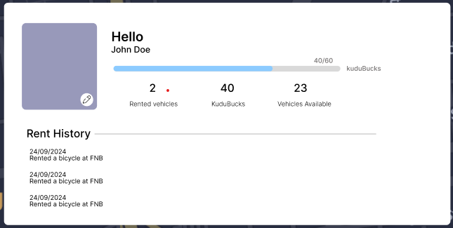

# About 📄

## Table of Contents
- [Key Features ](#keyfeatures)
- [Tools](#tools)
- [Diagrams](#Diagrams)
- [Implementations](#implementations)
- [Meetings](#meetings)
- [Testing](#testing)
- [Reports](#reports)

## Key Features 
- **Bike, Scooter, and Skateboard Rentals**: Rental service for bikes, scooters, and
skateboards to enhance campus mobility
- **Transportation Schedules**: Display a weekly schedule of the bus leaving and coming to campus.
- **Interactive Maps**: Navigate the Map
- **Real-Time GPS Tracking**: : Track real-time location of campus shuttles, buses, and
other transportation services
- **Accessibility Routes**:  Provide routes that accommodate individuals with disabilities.
- **Rental Stations**: Locate and check availability of rental stations across campus.

## Tools
- **Jira**: For planning.
- **Frontend**: React js,CSS.
- **Backend**: Express Js,Node Js, Azure, Vercel.
- **Communication**: Discord,Whatsapp,Emails
- **Authentication**: Firebase
- **Database**: Firebase Firestore
- **Figma**: Designing the UI and Protoype

## Diagrams

### user story🐾

### Deployment Diagram

### Component Diagram

### Wireframe

### Initial Mockups

### Official Mockups & Mobile view

#### Mobile view

### Protoype

If you want to interact with the prototype
**Figma Link**: https://www.figma.com/proto/ZuXHB5KS0UVghmuc7LD21M/Campus-Transportation?node-id=65-193&node-type=canvas&t=xv0NqEbJMG7L7af0-0&scaling=contain&content-scaling=fixed&page-id=0%3A1&starting-point-node-id=65%3A193&show-proto-sidebar=1

## Implementations

### Changes requested by our supervisor
- **Add some validation on the login/signup**: At the beginning of our app the user just had to put in their detail in this an email and password but after our meeting with our supervisor on the 5th of september, He suggested that we coudld have some validation for our password, like having special characters in our pasword also the having a specific length for the password. On top that we added a toast that pops everytime the user's password doesn't satisfy the requirements.
- **Add a hello {username} feature**: Every user has their name and email stored in the database such everytime when they log in to our system, on the profile page their usename printed out.Like the image below.

- **Add a profile page**: The image above is the implemented profile page on our system, shows you booked vehicles, it has it's own kudubucks system.
- **Add a change password feature on the Profile page**: Below is an image that kind of shows how a user can change their password on the profile page, they click the "change password link" and a pop up will show up, and they can either cancel or change their password.
- **Add Renting stations on the map**: We decided to add a bicycle landmark to every rental station on main campus.
- **Add pickup and dropoff stations**:🐾
- **Add more implementations luca required**:🐾
### Changes we discussed 
- **Change the theme of the app**: Now we added a feature for light/dark mode 
- **Add accessible routes on the map**:🐾
### Changes after integrating with other APIs
See "Link to implementations in the API specification"🐾

## Meetings

### Meetings Calendar

<iframe src="https://calendar.google.com/calendar/embed?src=91c70e37bf75f308d704076c16705683a16d3bfd0d0e8f4c76d1c2406452c19b%40group.calendar.google.com&ctz=Africa%2FJohannesburg" style="border: 0" width="800" height="600" frameborder="0" scrolling="no"></iframe>

### Future plans
As seen from the Calendar we have been tracking when to have out meetings and we do we need to plan our upcoming implementations for our app

### Timeline
For proof of meeting please checkout our drive "campus transportation>Meetings" :https://drive.google.com/drive/u/0/folders/1zxj784kdAtxYXiMoWFnsLQTfLaxCZ4dK
#### Scrum 1 🎯
#### 12 August 2024 
- Dicussion: Tools, setting up our environment and getting started
- Attendees: Uhone, Kgolagano, Lethabo, Obakeng, Gael, Wendy
#### 14 August 2024
- Dicussion: Designing Wireframe and assigning roles
- Attendees: Uhone, Kgolagano, Lethabo, Obakeng, Gael, Wendy
#### 17 August 2024
- Dicussion: UI designs and database schema,API
- Attendees: Uhone, Kgolagano, Lethabo, Obakeng, Gael, Wendy
#### 18 August 2024
- Dicussion: UI design and Prototype
- Attendees: Uhone, Lethabo, Gael, Wendy
#### 20 August 2024 Milestone 1 🏆
#### Scrum 2 🎯
#### 24 August 2024
- Dicussion: Milestone Overview
- Attendees: Uhone, Kgolagano, Lethabo, Obakeng, Gael, Wendy
#### 28 August 2024
#### 29 August 2024
- Dicussion: Client Meeting, adding more features like having a login,signup page
- Attendees: Uhone, Kgolagano, Lethabo, Obakeng, Gael, Wendy, Luca
#### 12 August 2024
#### 12 August 2024
#### 12 August 2024
#### 12 August 2024

### User Feedback 🐾

### User Guide 🐾

## Testing

logout.test.jsx
This file contains tests for the Logout component, utilizing React Testing Library and Jest to validate the component's behavior during user interaction. The primary objective is to confirm that the component navigates correctly based on user choices.

Purpose:
The tests ensure that the Logout component correctly navigates to either the login page or the homepage, depending on whether the user chooses to log out or cancels the action.

Mocking:
The useNavigate hook from react-router-dom is mocked to control navigation behavior, allowing verification without actual page redirection.
mapbox-gl is also mocked since the Logout component uses it, but it's not part of the functionality being tested.

signupForm.test.jsx
This test file contains unit and user acceptance tests for the SignUpForm component. The tests use React Testing Library and Jest to validate the component's behavior during various user interactions, focusing on form validation, signup flow, and navigation.

Purpose:
The tests verify that the SignUpForm component provides correct user feedback, handles signup successfully, and navigates as expected when users interact with the form.
Mocking:

Firebase Functions: The Firebase functions (createUserWithEmailAndPassword, sendEmailVerification, setDoc) are mocked to isolate the component's behavior without real API calls.
Navigation: The useNavigate function from react-router-dom is mocked to validate navigation without actual redirection.
Tests Overview:

"should display validation error for weak password":
Type: Unit Test
Purpose: This unit test verifies that the component correctly handles password validation.
Behavior Tested: When a weak password is entered, it checks that the validation error message is displayed and createUserWithEmailAndPassword is not called.
"should handle successful signup":
Type: Unit Test and User Acceptance Test (UAT)
Purpose: The test is both a unit test for the signup logic and a user acceptance test to ensure a smooth user flow.
Behavior Tested: It simulates a successful signup flow, including submitting valid information, verifying if createUserWithEmailAndPassword, sendEmailVerification, and setDoc are called appropriately, and confirming the success message is displayed.
"navigates to the login page when 'Log In' is clicked":
Type: Unit Test and User Acceptance Test (UAT)
Purpose: This test ensures that the user can navigate to the login page.
Behavior Tested: It checks if clicking the "Log In" link triggers the navigation to the login page ('/').

loginForm.test.jsx
This file contains unit and user acceptance tests for the LoginForm component. The tests use React Testing Library and Jest to validate how the component behaves during different user interactions, specifically focusing on rendering, password visibility, and login functionality.

Purpose:
The tests verify that the LoginForm component renders correctly, handles password visibility, and manages login attempts (both successful and unsuccessful).
Mocking:

Firebase Functions: The signInWithEmailAndPassword function from Firebase is mocked to simulate login behavior without making real network requests.
Routing: renderWithRouter is used to wrap the component in a BrowserRouter, simulating a real browser environment for routing purposes.
Tests Overview:

"renders the login form":
Type: Unit Test
Purpose: Ensures that the LoginForm component renders properly with the email input, password input, and sign-in button present.
Behavior Tested: Verifies the initial rendering of the form to confirm that all expected elements are in place.
"allows user to toggle password visibility":
Type: Unit Test and User Acceptance Test (UAT)
Purpose: This test checks that users can toggle password visibility using the icon.
Behavior Tested:
Initially, the password should be hidden.
Clicking the toggle icon changes the type of the password input from "password" to "text" and vice versa.
As a UAT, it confirms that the component provides expected behavior for user convenience.
"displays error when login credentials are invalid":
Type: Unit Test and User Acceptance Test (UAT)
Purpose: Tests the login flow when incorrect credentials are provided.
Behavior Tested:
Mocks a rejected signInWithEmailAndPassword call, resulting in an error toast message.
As a UAT, it ensures that the user gets appropriate feedback when their login attempt fails.

## Reports
🐾
- On the 12th of August we had issues with trying to deploy the "Hello-world" page
