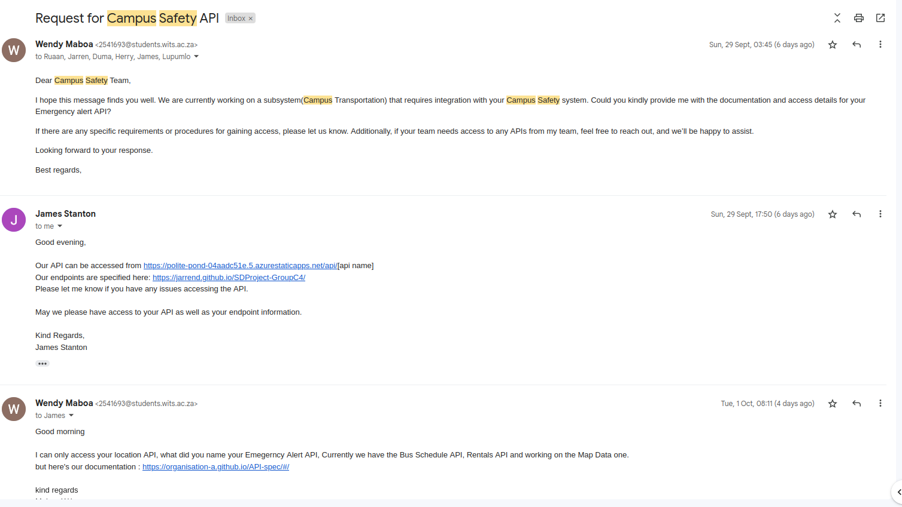
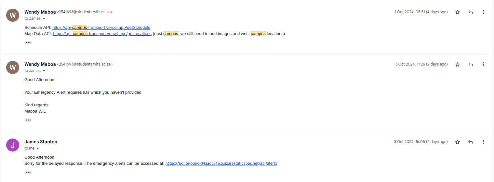
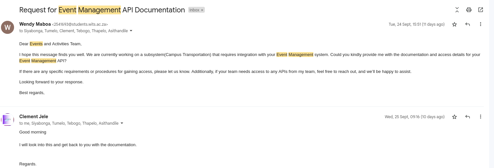
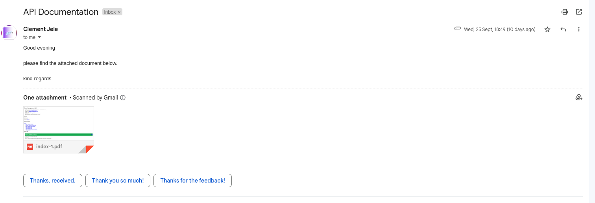
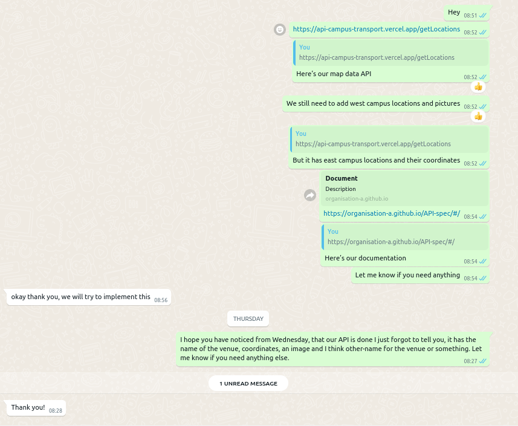

# API specification

> The Campus Transportation API provides a comprehensive solution for managing and optimizing transportation services across wits campus. This API allows developers to integrate key functionalities such as getting map data, route management, and bus schedule into campus-wide systems. It is designed to facilitate smooth operation of campus shuttles, improve student and staff transit experiences, and ensure effective communication of transportation information.

With this API doc, users can :

- Can have access to data about buildings,routes and amenities.
- Access Real-Time tracking for campus transportation facilities
- Get data on accessible routes and facilities.
- Have a view od the Trabsportation schedule and updates
- Get the best routes based on their current conditions
- Access to rental stations and a view of which vehicles are available.

## Map data API
<iframe src="./API/MapDataAPI.html" width="100%" height="800px"></iframe>

## Transportation Schedule API
<iframe src="./API/Trans.html" width="100%" height="800px"></iframe>

## Rental Service API 
<iframe src="./API/RentalServiceAPI.html" width="100%" height="800px"></iframe>

## Internal and External APIs

### Backend

For the backend, we have made use of **Vercel** since it is an optimal technology, easy to use, and helps with separation of concerns. This is particularly useful because we want to prevent the entire system from failing if either the backend or frontend experiences an issue. By separating both ecosystems, management becomes much more efficient.

The main reason we chose Vercel is because it makes our APIs available to other teams, facilitating integration into their systems without relying on Azure deployment. Vercel is more user-friendly and has a gentler learning curve compared to Azure, which can often be more complex. Additionally, adding both the frontend and backend to Azure would increase the complexity of the project, which is not ideal.

### Frontend

For the frontend, we used **Azure** because it is a technology we are more familiar with. While we used Vercel for the backend, Azure is sufficient for deploying the frontend.

In this approach, we aimed to use familiar, new, and optimal technologies, taking into consideration the integration with other teams.

### APIs

As mentioned before, our APIs are deployed using **Vercel** for the backend. This allows us to have live links to integrate with other teams when necessary.

#### External API
- **/getLocations**: Used to retrieve campus buildings, and can be accessed through the following link:  
  `https://api-campus-transport.vercel.app/getLocations`

#### Internal APIs
- **GET** requests:
  - `/getRent`: Retrieves all items available for renting along with their details.  
    `https://api-campus-transport.vercel.app/getRent`
  - `/getSchedule`: Retrieves the bus schedule, specifically for buses arriving and departing from campus.  
    `https://api-campus-transport.vercel.app/getSchedule`

- **POST** requests:
  - `/rent/${UID}/${ritem}`: Adds a rented item to the user's collection, associating the user with the rented item.  
    `https://api-campus-transport.vercel.app/rent/${UID}/${ritem}`
  - `/cancel-rent/${UID}/${ritem}`: Updates the user's collection to cancel or complete a rental, removing the fields for the item and its location.  
    `https://api-campus-transport.vercel.app/cancel-rent/${UID}/${ritem}`

The POST APIs require the user ID (`UID`) and rented item ID (`ritem`) as arguments.

We recommend using **axios** for making API requests.

### BuildingMap Component API Documentation

#### Overview:

The `BuildingMap` component is a React-based implementation of a Google Maps interface with additional features such as route calculation, custom markers, and user location tracking. It utilizes various Google Maps APIs and services to provide an interactive map experience.

#### Dependencies:

- React
- @googlemaps/js-api-loader
- axios
- Firebase (auth and firestore)
- react-toastify

#### Component State:

The component uses various state variables and refs to manage its functionality:

- `googleMaps`: Stores the Google Maps API object
- `userLocation`: Tracks the user's current location
- `directions`: Stores the calculated route directions
- `selectedMode`: Manages the selected travel mode
- `isDarkStyle`: Controls the map's visual style
- `userPickup`: Stores the user's pickup location
- `UID`: Stores the user's ID
- `selectedCoordinates`: Stores the selected destination coordinates

#### Main Functions:

##### `calculateDistance(lat1, lon1, lat2, lon2)`

Calculates the distance between two geographical points using the Haversine formula.

##### `handleDropOff(ritem)`

Handles the drop-off functionality for rentals by making an API call.

##### `handleDrop(location)`

Checks if the user is within range of a drop-off location and calls `handleDropOff` if true.

##### `calculateRoute(origin, destination)`

Calculates and displays a route between two points using the Google Maps Directions Service.

##### `createMarkersAndCalculateRoute(originLatLng, destinationLatLng)`

Creates origin and destination markers and calculates the route between them.

##### `loadPersistedRoute()`

Loads a previously saved route from local storage.

##### `calculateAndDisplayRoute(destination)`

Calculates and displays a route from the user's current location to a specified destination.

##### `addCustomLocationMarkers()`

Adds custom markers to the map for predefined rental locations.

##### `toggleMapStyle()`

Toggles between dark and light map styles.

##### `recenterMapToUserLocation()`

Recenters the map to the user's current location.

#### Google Maps API Usage:

##### Map Initialization

The component uses the `@googlemaps/js-api-loader` to load the Google Maps API:

```javascript
const loader = new Loader({
  apiKey: "YOUR_API_KEY_HERE",
  version: "weekly",
  libraries: ["places"],
});
```

##### Map Creation

A new map instance is created using:

```javascript
new googleMaps.maps.Map(mapRef.current, {
  center: userLocation,
  zoom: 17,
  fullscreenControl: false,
  mapTypeControl: false,
  zoomControl: true,
  streetViewControl: true,
  styles: isDarkStyle ? MapStyle : [],
});
```

##### Directions Service and Renderer

The component uses the DirectionsService and DirectionsRenderer for route calculations:

```javascript
directionsServiceRef.current = new google.maps.DirectionsService();
directionsRendererRef.current = new google.maps.DirectionsRenderer({
  suppressMarkers: true,
});
```

##### Info Windows

Info windows are used to display additional information when markers are clicked, implemented with `google.maps.InfoWindow`.

#### User Interaction

- Users can click on the map to set a destination and calculate a route.
- Users can toggle between dark and light map styles.
- Users can recenter the map to their current location.
- Users can select different travel modes (Walking, Driving, Bicycling, Transit).
- Users can view turn by turn directions for the calculated route.

#### Firebase Integration

The component integrates with Firebase for user authentication and data storage:

- It listens for changes in the user's authentication state.
- It fetches user data from Firestore when a user is authenticated.

#### Local Storage

The component uses local storage to persist:
- The last calculated route
- The user's preference for dark/light map style

#### Event Handling

The component sets up various event listeners:
- Map click events for route calculation
- Marker drag events for route recalculation
- Custom 'getDirections' event for external direction requests

## Implementation

### Using the Emergency Alert API

We have decided to implement a popup feature that will appear during emergency situations, displaying the time of the emergency and relevant information. This popup will prevent the user from interacting with any other features of the app until they acknowledge the alert and take the necessary steps to evacuate the premises.


### Using the Events Management API

We decided to add a uique landmark on the map that show up when there's an event on campus.

*Picture of the implementation*🐾

## Communication with the other teams

### Campus safety - Emergency Alert API



### Event Management - Events API



### Campus Infrastructure

