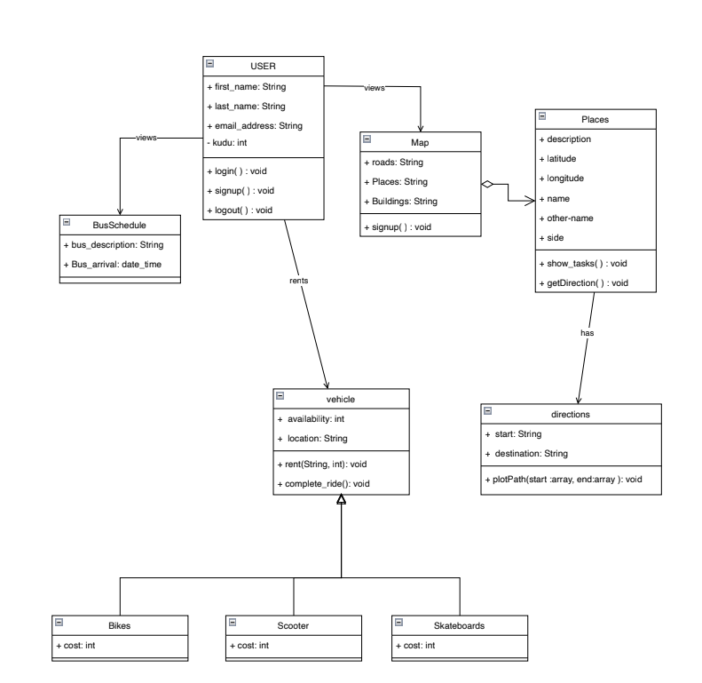

# Database Schema
>The Campus Transportation Database is designed to manage and streamline transportation services on campus. It supports various functionalities, including vehicle management, route scheduling, user information, and real-time tracking of vehicles. The schema is organized into several interconnected tables, ensuring data integrity and facilitating efficient access to transportation-related information.

## User database